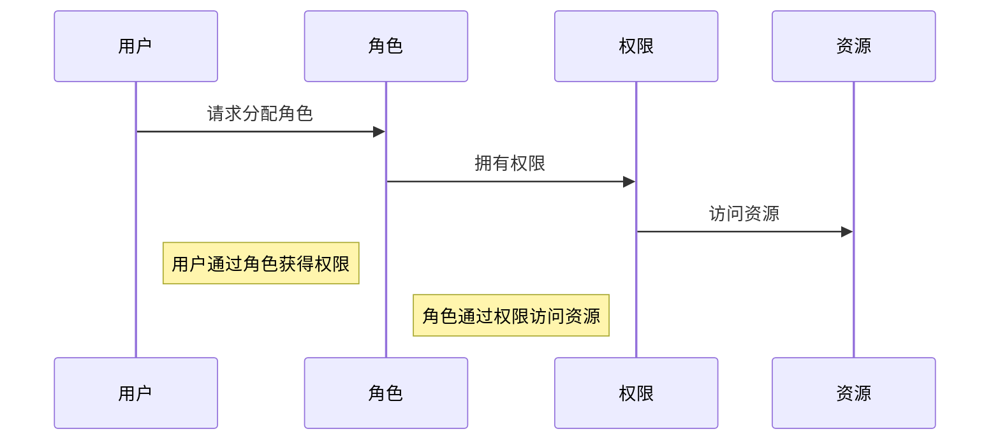
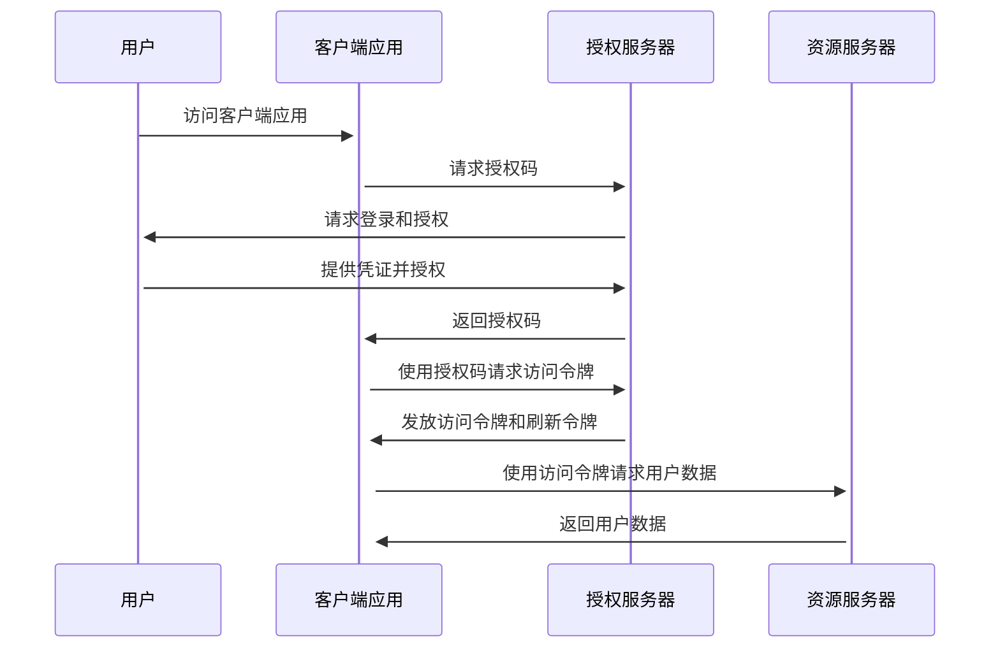
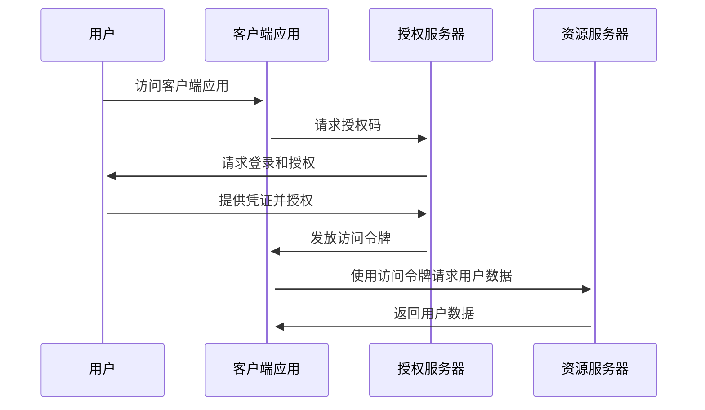
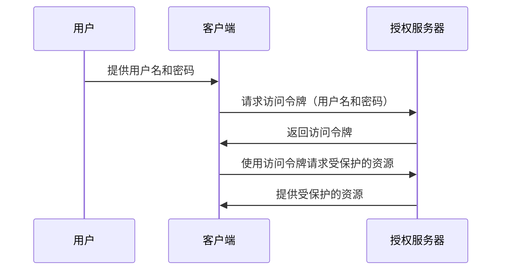
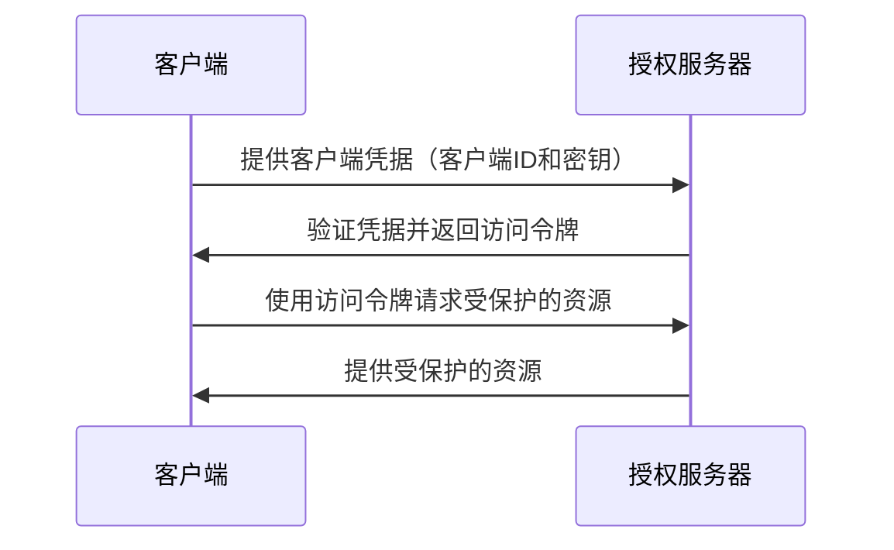

+++
date = '2024-04-15T13:49:14+08:00'
draft = false
title = '基本的访问和授权模型：OAuth2 和 RBAC 的组合应用'
+++

### 概述

在安全管理系统里面，授权（Authorization）的概念常常是和认证（Authentication）、账号（Account）和审计（Audit）一起出现的，并称之为 4A。就像上一文章提到的，对于安全模块的实现，最好都遵循行业标准和最佳实践，授权也不例外。

作为安全系统的一部分，授权的职责如下：

* 确保授权过程的可控：常见的参考标准有 OAuth2、SAML2、CAS 等协议
* 确保授权结果的可控：常见的参考标准有 RBAC、ABAC 等授权模型

对于大多数应用来说，主流的做法是基于 OAuth2 + RBAC 的组合搭配实现授权。下面就从这两个方向展开聊聊。

### RBAC

RBAC（角色基础访问控制）是一种常见的权限管理方式。在这种模型中，系统根据用户的角色来分配权限，而不是直接分配给单个用户。这样可以简化权限管理和配置的复杂性。避免频繁的对用户进行权限操作。如下：

如果还有更复杂的访问控制需求，则可以在 RBAC0 的基础上可以扩展 RBAC1 （层次化 RBAC，角色之间有继承关系）和 RBAC2（受约束的 RBAC，角色之间有互斥关系）来提高系统的安全性和管理的便利性。还有 RBAC 3 等等。

对于大多数应用来说，通常都无需自己去实现这些理论的模型，应用遇到的安全问题大多都是相同的，具有普遍性，所以可以抽象到框架层面来解决，例如著名的 Spring Security 框架就提供 RBAC 模型的授权实现。

不过，需要特别说明的是，与具备通用性的访问控制权限相比，对于数据权限的控制则显的困难的多，用户能访问的数据权限通常与业务高度关联，具体到不同部门，不同角色，甚至指定人员可以访问的数据权限都不尽相同。完全不具备通用性，所以无法通过框架层面解决，就连 Spring Security 框架也未能提供数据权限的相关控制。只能有业务系统结合实际情况各自在业务层实现，这也是目前无法解决的问题。

### OAuth 2

OAuth2 是一种业界标准的授权协议，允许用户授权第三方应用程序访问他们在其他服务提供者上的资源，而无需分享用户名和密码，它定义了四种授权交互模式，适用于各种应用场景：

* 授权码模式
* 隐式授权
* 用户模式
* 应用模式

OAuth2 通过发放访问令牌（Access Token）和刷新令牌来实现对受保护资源的访问控制。通过创新的使用访问令牌 Token 替代了用户密码，避免用户凭证的泄露。

#### 授权码

授权码模式可以说是最安全的授权模式，综合考虑了各种风险和防范措置，但相对也是最复杂的授权协议，适合有服务端可以存储密钥（ClientSecret）的场景，授权流程如下：

看完授权码的过程，你可能会觉得好奇：**为什么授权服务器要返回授权码，而不直接返回令牌呢 ？**

返回授权码而不是直接返回令牌的设计主要是为了提高安全性，原因如下：

1. 即使授权码被截获，攻击者因为没有客户端密钥无法获取访问令牌，客户端密钥只在服务器端保存，不会通过前端暴露。
2. 在重定向回客户端应用的过程中，授权码会通过浏览器传输。如果直接传输访问令牌，一旦泄露，就会带来更高的安全风险。授权码则可以进行严格的限制（如一次性使用，很短的有效期），所以即使泄露也难以被利用。
3. 在客户端使用授权码请求访问令牌时，授权服务器可以验证请求中包含的客户端密钥和重定向 URI 等信息，确保令牌的请求合法

另外令牌颁发的策略上，授权码模式下也使用长刷新令牌 + 短访问令牌的双令牌策略，来最大化减少 JWT 令牌无状态难回收的问题。因此，在服务端可以存储令牌的前提下，授权码模式可以说是大多数场景下的首选。

#### 隐式授权

隐式授权模式对于实在没有服务端存储 ClientSecret 的纯前端应用提供接入支持。接入流程也比较简单，如下：

该模式下用户认证通过后授权服务器就直接向客户端返回令牌，无需应用提供 ClientSecret 和通过授权码获取令牌的步骤。但是代价是安全等级降低，令牌有可能在重定向的时候暴露给攻击者。

为了挽救安全等级的问题，OAuth 2 也尽可能做了最大的努力，例如：

1. 限制第三方应用的回调 URI 地址必须与注册时提供的域名一致
2. 在隐式模式中明确禁止发放刷新令牌
3. 令牌必须是 “通过 Fragment 带回” 的（意味着只能通过 Script 脚本来读取，具体参考 RFC 3986）

可以看到隐式授权已经尽最大努力地避免了令牌泄漏出去的可能性。也并非主流的 OAuth 2 接入方式，若非迫不得已，大多数场合不推荐使用。

#### 密码模式

主要是用于一些非浏览器的接入场景，如果要采用密码模式，那“第三方”属性就必须弱化，把“第三方”视作是系统中与授权服务器相对独立的子模块，在物理上独立于授权服务器部署，但是在逻辑上与授权服务器仍同属一个系统，这样将认证和授权一并完成的密码模式才会有合理的应用场景：

密码模式非常简单，就是拿着用户名和密码向授权服务器换令牌而已。在密码模式下 OAuth2 不负责保障安全，只能由用户和第三方应用来自行提供安全保障。

#### 客户端模式

以应用为主体的授权模式，不涉及到用户的登录行为，是客户端模式是指第三方应用以自己的名义，向授权服务器申请许可凭证。用来访问受保护资源，如下：

客户端模式通常是用于微服务之间的访问，例如一些定时任务，应用之间访问授权的操作。在微服务架构并不提倡同一个系统的各服务间有默认的信任关系，所以服务之间调用也需要先进行认证授权，然后才能通信。例如应用层常见的微服务框架 `Spring Cloud` 就是采用该方案保证服务间的合法调用。
