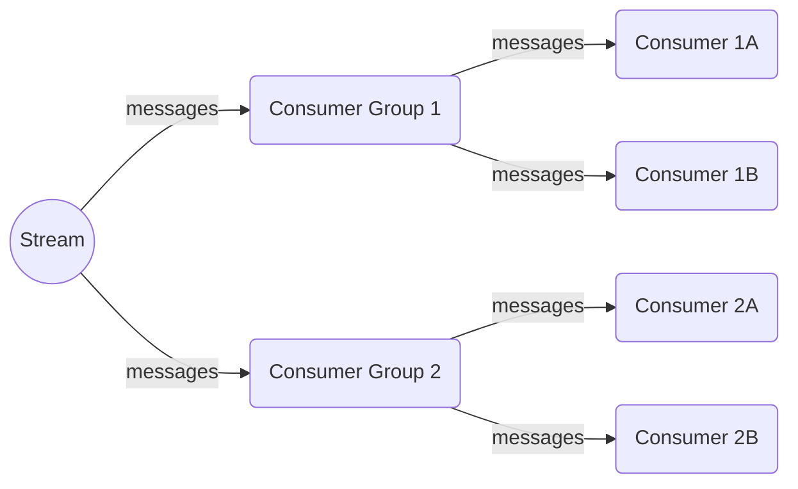

+++
date = '2023-04-17T14:24:51+08:00'
draft = false
title = 'Redis Stream: A More Complete Message Queue'
tags = ["Redis", "Database"]
+++

> This data structure requires Redis 5.0.0+ to be available.

### Overview

Redis Stream is a new data structure introduced in Redis 5. It is a high-performance, highly reliable message queue primarily used for asynchronous message processing and streaming data processing. Before this, implementing a message queue in Redis usually involved one of three data structures: Lists, Sorted Sets, or Pub/Sub. However, Stream offers several advantages over them:

* **Range Search Support**: Built-in indexing allows for range searches of messages.
* **Blocking Operation Support**: Avoids inefficient constant polling for messages.
* **ACK Support**: Provides an acknowledgment mechanism to confirm successful message processing, ensuring reliability.
* **Multiple Consumer Support**: Multiple consumers can consume from the same stream simultaneously; Redis ensures each consumer can process messages independently.

Without further ado, let's look at how to use it. (PS: This is a long post; please fasten your seatbelt.)

### XADD: Adding Elements

The syntax for the XADD command is as follows:

```perl
XADD stream-name id field value [field value]
```

* **stream-name**: The name of the Redis stream.
* **id**: The message ID in the stream, usually represented by `*` for auto-generation.
* **field value**: The content of the message, formatted as key-value pairs.

Key characteristics of using XADD to add elements:

* **Auto-creation**: Redis automatically creates the stream (e.g., `my-stream`) if it doesn't exist and appends the element to the end.
* **Arbitrary KV Pairs**: Each element in the stream can contain one or more key-value pairs.

Example of adding a new message using XADD:

```perl
XADD my-stream * name John age 30 email john@example.com
```

Explanation of the command:
1. Adds a new message to the Redis stream named `my-stream`.
2. `*` indicates an auto-generated message ID.
3. `name`, `age`, and `email` are the field names.
4. `John`, `30`, and `john@example.com` are the field values.

#### Stream Element ID

After successful execution, XADD returns the element ID:

```perl
"1681138020163-0"
```

Each element ID is an incrementally unique identifier consisting of two parts: a timestamp and a sequence number.

* The **timestamp** is a 64-bit signed integer representing the milliseconds elapsed since the Unix epoch.
* The **sequence number** is an incremental integer starting from 0.

To demonstrate, we can send a message with a specific ID:

```sh
XADD my-stream 1681138020163-1 name Mary age 25 email mary@example.com
```

Result:
```sh
"1681138020163-1"
```

Finally, you can preview the data pushed into the stream using `XRANGE`:

```sh
XRANGE my-stream - +
```

Result:
```sh
1) 1) "1681138020163-0"
   2) 1) "name"
      2) "John"
      3) "age"
      4) "30"
      5) "email"
      6) "john@example.com"
2) 1) "1681138020163-1"
   2) 1) "name"
      2) "Mary"
      3) "age"
      4) "25"
      5) "email"
      6) "mary@example.com"
```

#### Stream Element ID Restrictions

Element IDs play a crucial role in Redis Stream; they ensure uniqueness and ordering while providing efficient range queries and analysis. When using Redis Stream, you must pay attention to ID restrictions:

* The ID must be unique.
* The ID of a new element must be greater than all existing element IDs in the stream.

There are also restrictions on length and special characters. Adding an element that violates these rules will result in a rejection and an error from Redis.

**How is the maximum element ID updated?**
After successfully executing an XADD command, the stream's maximum element ID is automatically updated.

**Why must a new element ID be greater than all existing ones?**
This restriction ensures the uniqueness and sequential nature of every element in the stream. This is vital for message queues and event systems: users can be certain that new messages/events only appear after existing ones, just as in the real world—everything proceeds in an orderly fashion.

#### Auto-generation Rules

Using `*` for auto-generated IDs is very convenient. Here are the rules:
1. The timestamp part is the current time in milliseconds since the Unix epoch.
2. The sequence number starts at 0 and increments. It is a 64-bit integer.

#### Limiting Stream Length

Stream data is usually temporary. If the length isn't limited, the following issues occur:
1. **Memory Exhaustion**: As messages increase, so does memory usage. Long-running apps risk running out of memory.
2. **Performance Impact**: More data makes queries and operations slower and maintenance harder.

To avoid this, use the MAXLEN option with XADD to specify the maximum length:

```sh
XADD stream [MAXLEN len] id field value [field value ...]
```

Example:

```sh
XADD mini-stream MAXLEN 3 * k1 v1
XADD mini-stream MAXLEN 3 * k2 v2
XADD mini-stream MAXLEN 3 * k3 v3
XADD mini-stream MAXLEN 3 * k4 v4

# After adding 4 messages to a stream limited to 3:
XRANGE mini-stream - +
1) 1) "1681140898447-0"
   2) 1) "k2"
      2) "v2"
2) 1) "1681140901790-0"
   2) 1) "k3"
      2) "v3"
3) 1) "1681140906703-0"
   2) 1) "k4"
      2) "v4"
```

You'll see that the earliest `k1` message has been removed. Redis deletes the oldest elements to maintain the specified length.

### XTRIM: Trimming the Stream

In addition to limiting length during XADD, Redis provides the XTRIM command for manual trimming:

```sh
XTRIM stream MAXLEN len
```

Example:
```sh
XTRIM my-stream MAXLEN 2
(integer) 1
```
This command trims `my-stream` to a maximum of 2 messages, removing older messages that exceed this length.

### XDEL: Removing Elements

XDEL is used to delete specific messages from a stream. It requires the stream key and one or more message IDs. It returns the number of successfully deleted messages.

Syntax:
```sh
XDEL key ID [ID ...]
```

Example:
```sh
# Deleting a specific ID from the stream
XDEL my-stream 1681480521617-0
(integer) 1

# Batch deleting multiple IDs
XDEL my-stream 1681480524451-0 1681480526810-0 1681480965273-0
(integer) 3
```
Note: `XDEL` does not modify the stream's length counter; the length reported by some commands might remain the same even after deletion.

### XLEN: Getting Stream Length

XLEN returns the number of messages currently in the stream. It's simple and efficient.

Syntax:
```sh
XLEN key
```

Example:
```sh
XLEN my-stream
(integer) 4
```
Note: `XLEN` only returns the count, not the content. See `XRANGE` for content.

### XRANGE: Querying Messages

`XRANGE` is primarily used to fetch a continuous segment of messages. There's also a similar `XREVRANGE` command:
* `XRANGE` returns results in ascending order of message ID.
* `XREVRANGE` returns results in descending order (very useful for finding the latest messages).

`XRANGE` syntax:
```sh
XRANGE key start end [COUNT count]
```

#### Fetching a Specific Message
To fetch a specific message, set `start` and `end` to the same ID:
```sh
XRANGE my-stream 1681480968241-0 1681480968241-0
```

#### Fetching Multiple Messages
Use the COUNT option:
```sh
# Fetch the 5 earliest messages
XRANGE my-stream - + COUNT 5
```
`-` and `+` represent the minimum and maximum possible IDs.

#### Fetching All Messages
Remove the COUNT option:
```sh
XRANGE my-stream - +
```

#### Fetching in Reverse
`XREVRANGE` syntax:
```sh
XREVRANGE key end start [COUNT count]
```
Example:
```sh
XREVRANGE my-stream + - COUNT 3
```
Returns the 3 latest messages in `my-stream`.

#### XRANGE Scenarios
In business scenarios, these commands are used for:
* **Pagination**: Specifying `start`, `end`, and `COUNT`.
* **Real-time Monitoring**: Fetching the latest messages for dashboards.
* **Data Export**: Exporting a range of messages to other systems.

### XREAD: Blocking Read

Unlike `XRANGE`, `XREAD` is used to read messages with specific features:
* Reads from multiple streams simultaneously.
* Supports blocking mode to process new messages immediately upon arrival.
* Supports `BLOCK` parameters to control wait time.

Blocking mode is ideal for building real-time data processing apps like event-driven or real-time analysis systems.

Syntax:
```sh
XREAD [COUNT count] [BLOCK milliseconds] STREAMS key [key ...] ID [ID ...]
```

#### Query Mode
Apart from reading multiple streams, it's similar to `XRANGE`.
Example:
1. Reading from a single stream from the beginning:
```sh
XREAD STREAMS my-stream 0
```
`0` means read all. If an ID is provided, it reads only messages after that ID.

2. Reading from multiple streams:
```sh
XREAD STREAMS my-stream mini-stream 0 0
```
Each ID parameter corresponds to a stream key.

#### Blocking Mode
When using blocking mode, `XREAD` behaves as follows:
1. **No block**: If matching elements exist, it returns immediately.
2. **Unblock**: Occurs on timeout or when new messages arrive.
3. **Infinite block**: Waits indefinitely for new messages.

Examples:
1. No blocking behavior:
```sh
XREAD BLOCK 1000000 COUNT 1 STREAMS my-stream 0
1) 1) "my-stream"
   2) 1) 1) "1681480968241-0"
         2) 1) "k5"
            2) "v5"
```

2. Unblocking scenarios:
```sh
# Timeout: Unblocks after 5s if no new messages arrive
XREAD BLOCK 5000 STREAMS my-stream 1681482023346-0
(nil)
(5.09s)

# New message: Unblocks immediately when a message with ID > provided ID arrives
XREAD BLOCK 50000 STREAMS my-stream 1681482023346-0
1) 1) "my-stream"
   2) 1) 1) "1681485525804-0"
         2) 1) "newMessage"
            2) "v1"
(18.46s)
```

3. Infinite blocking:
Setting wait time to 0 keeps the command blocking indefinitely:
```sh
XREAD BLOCK 0 STREAMS my-stream $
```
`$` means only read messages that arrive after this command started.

### Consumer Groups

A Consumer Group is a mechanism to organize multiple consumers to collaboratively process messages from the same stream. It facilitates load balancing, high availability, and fault tolerance.

**Working Principle:**
1. The Stream distributes messages; all subscribed Consumer Groups receive the messages (Groups share the stream).
2. The Group itself doesn't process messages; it distributes them to Consumers for actual consumption (Consumers are exclusive within the group).

Visual Model:



This model enables:
* **Load Balancing**: Distributing messages across multiple consumers.
* **High Availability**: Ensuring messages are processed even if one consumer fails.
* **Fault Tolerance**: Supporting re-processing of failed messages.

Next, let's detail the related commands.

### XGROUP: Managing Consumer Groups

#### CREATE: Creating a Group

Use `XGROUP` to associate a group with a stream.

Syntax:
```sh
XGROUP CREATE stream group id [MKSTREAM]
```
* **id**: Start ID. Use `$` for only new messages, `0` for all existing messages.
* **MKSTREAM**: Automatically creates the stream if it doesn't exist.

Example:
```sh
# Create a group that starts from the end, auto-creating the stream
XGROUP CREATE mystream mygroup $ MKSTREAM
OK

# View groups in the stream
XINFO GROUPS mystream
1)  1) "name"
    2) "mygroup"
    3) "consumers"
    4) (integer) 0
    5) "pending"
    6) (integer) 0
    7) "last-delivered-id"
    8) "0-0"
# ...
```

#### SETID: Modifying the Last Delivered ID

To ignore certain messages or re-process to debug, use `XGROUP SETID`:
```sh
XGROUP SETID stream group id
```

Example:
```sh
# Reset mygroup to start from a specific ID
XGROUP SETID mystream mygroup 1681655893911-0
OK

# View changes
XINFO GROUPS mystream
# ... last-delivered-id updated ...
```

#### XREADGROUP: Reading Messages

Syntax:
```sh
XREADGROUP GROUP <group> <consumer> [COUNT <n>] [BLOCK <ms>] STREAMS <stream_key> ... <id> ...
```
* **id**: Use `>` to read new messages that haven't been delivered to any other consumer in the group.

Example:
```sh
# Read new messages as 'myconsumer' in 'mygroup'
XREADGROUP GROUP mygroup myconsumer STREAMS mystream >
```

If we reset the ID to re-consume:
```sh
XGROUP SETID mystream mygroup 1681655893911-0

XREADGROUP GROUP mygroup myconsumer STREAMS mystream >
1) 1) "mystream"
   2) 1) 1) "1681655897993-0"
         2) 1) "k1"
            2) "v1"
# ... returns 4 messages ...

XINFO GROUPS mystream
# ... pending: 4 ... (Messages are unacknowledged)
```

#### XPENDING: Viewing Pending Messages

`XPENDING` retrieves info about messages that have been delivered but not yet acknowledged (PEL - Pending Entries List). This is crucial for:
* Monitoring consumption speed and efficiency.
* Troubleshooting stuck or failed consumers.
* Detecting backlogs under high load.
* Triggering alerts when pending counts exceed thresholds.

Syntax:
```sh
XPENDING stream group [start stop count] [consumer]
```

Examples:
Summary view:
```sh
XPENDING mystream mygroup
1) (integer) 4            # Total pending
2) "1681655897993-0"       # Earliest ID
3) "1681655916001-0"       # Latest ID
4) 1) 1) "myconsumer"      # Per-consumer pending count
      2) "4"
```

Detailed view of a specific message:
```sh
XPENDING mystream mygroup 1681655897993-0 1681655897993-0 1
1) 1) "1681655897993-0"    # ID
   2) "myconsumer"         # Consumer
   3) (integer) 2397387    # Last delivery time
   4) (integer) 1          # Delivery count
```

#### XACK: Processing Completion

`XACK` confirms a message has been processed. Informed of the success, Redis removes it from the PEL.

Syntax:
```sh
XACK stream group id [id ...]
```

Example:
```sh
XACK mystream mygroup 1681655897993-0
(integer) 1

# After acknowledging all:
XPENDING mystream mygroup
1) (integer) 0
# ...
```
`XACK` prevents duplicate processing during failures or recoveries.

#### XCLAIM: Message Transfer

`XCLAIM` allows a consumer to "take over" messages from another consumer that failed or timed out.

Syntax:
```sh
XCLAIM stream group new_consumer max_pending_time id [id ...]
```

Example:
```sh
# If message 1681660259887-0 has been pending for over 10s, transfer it to myconsumer2
XCLAIM mystream mygroup myconsumer2 10000 1681660259887-0
1) 1) "1681660259887-0"
   2) 1) "k1"
      2) "v1"

# Verify with XPENDING:
XPENDING mystream mygroup
# ... myconsumer pending: 1, myconsumer2 pending: 1 ...
```

#### XINFO: Inspecting Streams and Groups

`XINFO` subcommands provide detailed insights:

* **XINFO STREAM mystream**: Fetches length, group count, first/last entries, etc.
* **XINFO GROUPS mystream**: Lists groups and their status.
* **XINFO CONSUMERS mystream mygroup**: Lists consumers in a group.

These inform performance monitoring, optimization, and troubleshooting in Redis Stream apps.

#### Deletion Operations

**Removing a Consumer:**
```sh
XGROUP DELCONSUMER stream group consumer
```

**Destroying a Group:**
```sh
XGROUP DESTROY stream group
```

### Summary

Here's a recap of the Redis Stream commands covered:

1. **XADD**: Append a message.
2. **XREAD**: Read messages (supports multiple streams and blocking).
3. **XREADGROUP**: Read from a consumer group.
4. **XRANGE**: Range query in ID order.
5. **XREVRANGE**: Range query in reverse ID order.
6. **XDEL**: Delete a message.
7. **XTRIM**: Trim stream length.
8. **XLEN**: Get current length.
9. **XGROUP**: Manage groups (Create, Destroy, SetID).
10. **XACK**: Acknowledge a message.
11. **XPENDING**: View unacknowledged messages.
12. **XCLAIM**: Transfer ownership of pending messages.
13. **XINFO**: Detailed inspection of streams, groups, and consumers.

These commands provide full operational support for adding, deleting, reading, and trimming messages, alongside robust management for scaling consumers. Redis Stream is a powerful, persistent, and scalable data structure modeled after log files, supporting sophisticated parallel processing through its group mechanism.
